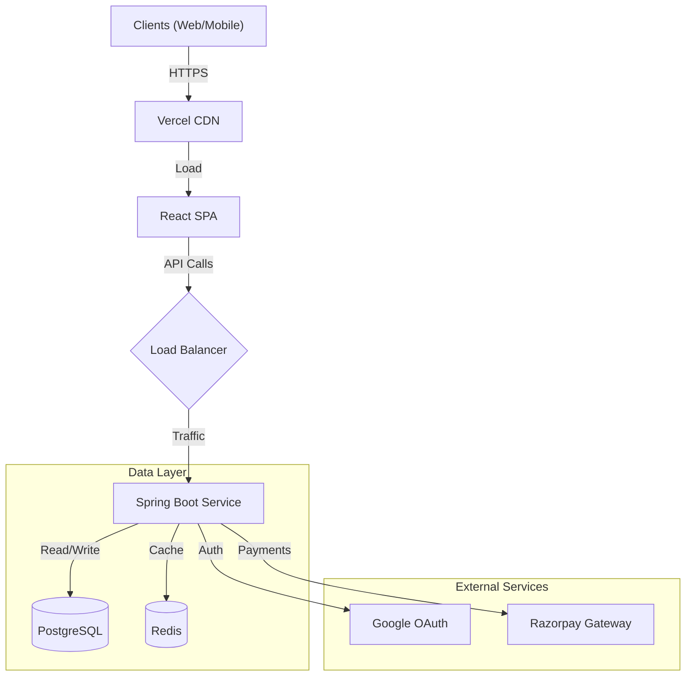
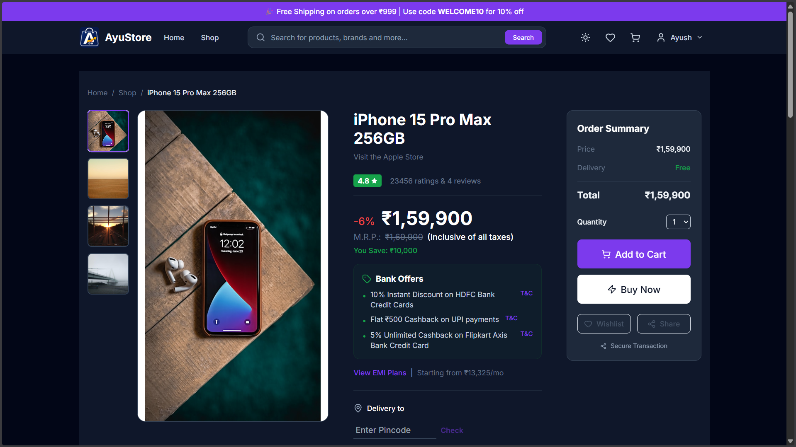
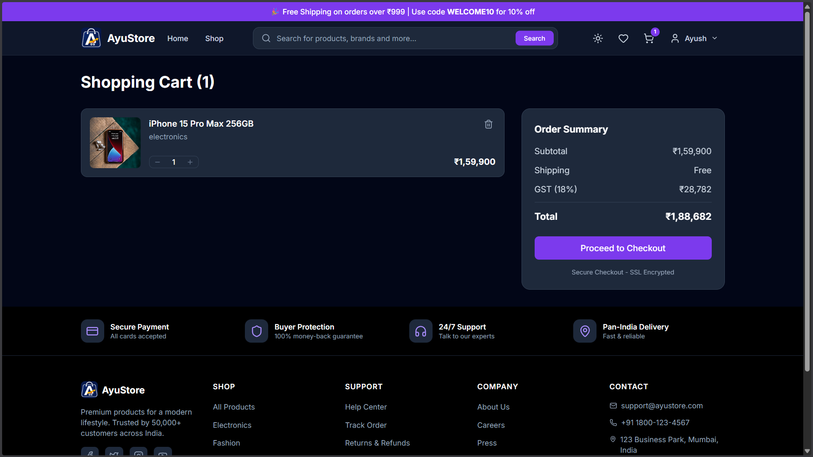
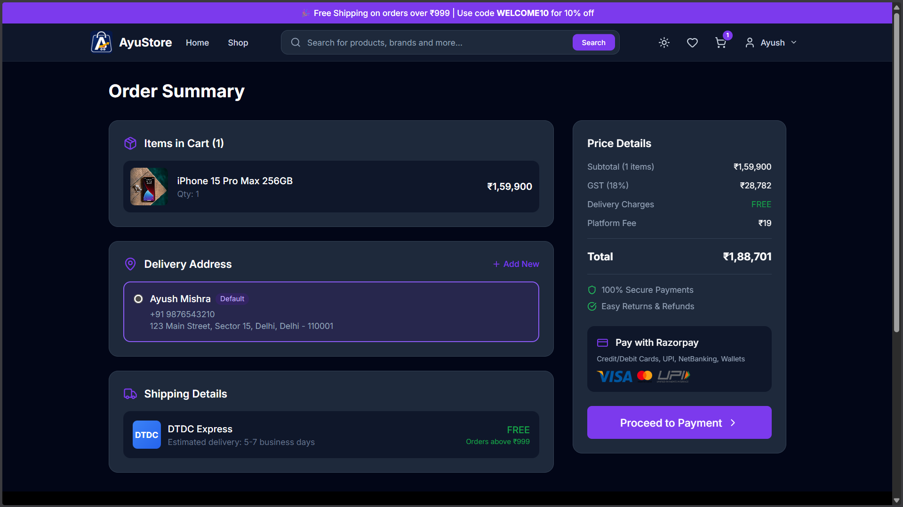

# 🛍️ AyuStore - Premium E-Commerce Platform

[](https://ayustore-shop.vercel.app)

> **A full-stack, production-grade e-commerce application built for the modern India.**  
> Featuring real-time payments, secure authentication, and a blazing fast user experience.

[](https://react.dev/)
[](https://spring.io/projects/spring-boot)
[](https://www.postgresql.org/)
[](https://redis.io/)
[](https://razorpay.com/)
[](LICENSE)

---

## 🚀 Overview

**AyuStore** is a comprehensive e-commerce solution designed to demonstrate enterprise-level architecture patterns. It bridges a dynamic **React** frontend with a robust **Spring Boot** microservices-ready backend, ensuring scalability, security, and performance.

The platform is tailored for the Indian market with **INR currency support**, **GST calculations**, and seamless **UPI/Card payments** via Razorpay.

---

## ✨ Key Features

### 🛒 Customer Experience
*   **Immersive Catalog**: Advanced filtering, search, and sorting (Price, Brand, Ratings).
*   **Rich Product Details**: Zoomable galleries, reviews, specifications, and "Similar Products" recommendations.
*   **Smart Cart & Wishlist**: Persistent cart management with real-time stock checks.
*   **Secure Checkout**: Integrated address management and **Razorpay** payment gateway.
*   **Order Tracking**: Detailed timeline view of order status (Processing -> Shipped -> Delivered).

### 🔐 Security & Auth
*   **Dual Authentication**: Support for both email/password (JWT) and **Google OAuth2**.
*   **Role-Based Access**: Granular permissions for Users and Admins.
*   **Secure API**: CSRF protection, input validation, and secure HTTP-only cookies.

### ⚡ Performance & Tech
*   **Caching**: Redis implementation for high-speed product retrieval.
*   **Responsive**: Mobile-first design using Tailwind CSS.
*   **Type Safety**: Full TypeScript integration on frontend.
*   **Containerized**: Docker support for consistent deployment.

---

## 🛠️ Tech Stack

### Frontend
*   **Framework**: React 18 with Vite
*   **Styling**: Tailwind CSS, Lucide React (Icons)
*   **State Management**: Context API + Custom Hooks
*   **Routing**: React Router v6
*   **HTTP Client**: Axios with Interceptors

### Backend
*   **Framework**: Spring Boot 3 (Java 17)
*   **Database**: PostgreSQL
*   **ORM**: Hibernate / Spring Data JPA
*   **Caching**: Redis
*   **Security**: Spring Security + OAuth2 Client
*   **Documentation**: OpenAPI (Swagger UI)

---

## 🏗️ Architecture



---

## 🏁 Getting Started

### Prerequisites
*   Node.js v18+
*   Java JDK 17+
*   Docker & Docker Compose (Optional)
*   PostgreSQL & Redis

### 1. Clone the Repository
```bash
git clone https://github.com/yourusername/ayustore-full-stack.git
cd ayustore-full-stack
```

### 2. Backend Setup
Navigate to the backend directory and configure environment variables.
```bash
cd backend
# Update application.yml or set env vars for DB credentials
./mvnw spring-boot:run
```
*The server will start at `http://localhost:8080`*

### 3. Frontend Setup
Navigate to the frontend directory and install dependencies.
```bash
cd frontend
npm install
npm run dev
```
*The app will be live at `http://localhost:3000`*

---

## 🔑 Environment Configuration

Create a `.env` file in the root (or configure system env vars) for production.

**Backend (`application.yml`) Variables:**
| Variable | Description |
| :--- | :--- |
| `DATABASE_URL` | JDBC URL for PostgreSQL |
| `REDIS_URL` | Connection string for Redis |
| `GOOGLE_CLIENT_ID` | OAuth2 Client ID |
| `RAZORPAY_KEY_ID` | Public Key for Payment Gateway |
| `JWT_SECRET` | Secret key for signing tokens |

**Frontend (`.env`) Variables:**
| Variable | Description |
| :--- | :--- |
| `VITE_API_URL` | Backend API URL (e.g., `https://api.yourdomain.com`) |
| `VITE_RAZORPAY_KEY_ID` | Public Key for Checkout Modal |

---

## 📸 Screenshots

| Home Page | Product Details |
| :---: | :---: |
|  |  |

| Shopping Cart | Checkout |
| :---: | :---: |
|  |  |

---

## 🤝 Contributing

Contributions are welcome! Please fork the repository and submit a Pull Request.

1.  Fork the Project
2.  Create your Feature Branch (`git checkout -b feature/AmazingFeature`)
3.  Commit your Changes (`git commit -m 'Add some AmazingFeature'`)
4.  Push to the Branch (`git push origin feature/AmazingFeature`)
5.  Open a Pull Request

---

## 📄 License

Distributed under the MIT License. See `LICENSE` for more information.

---

<center> Made with ❤️ by <b>Ayush</b> </center>
